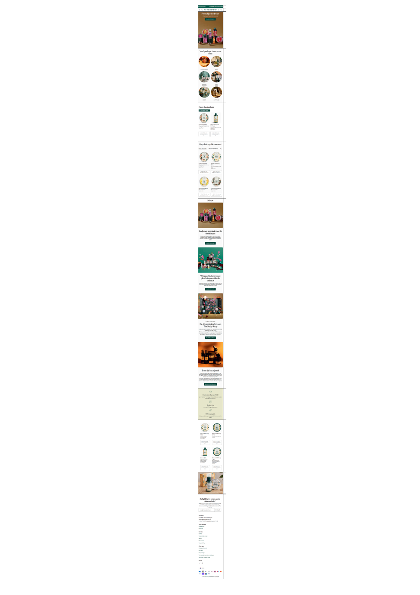
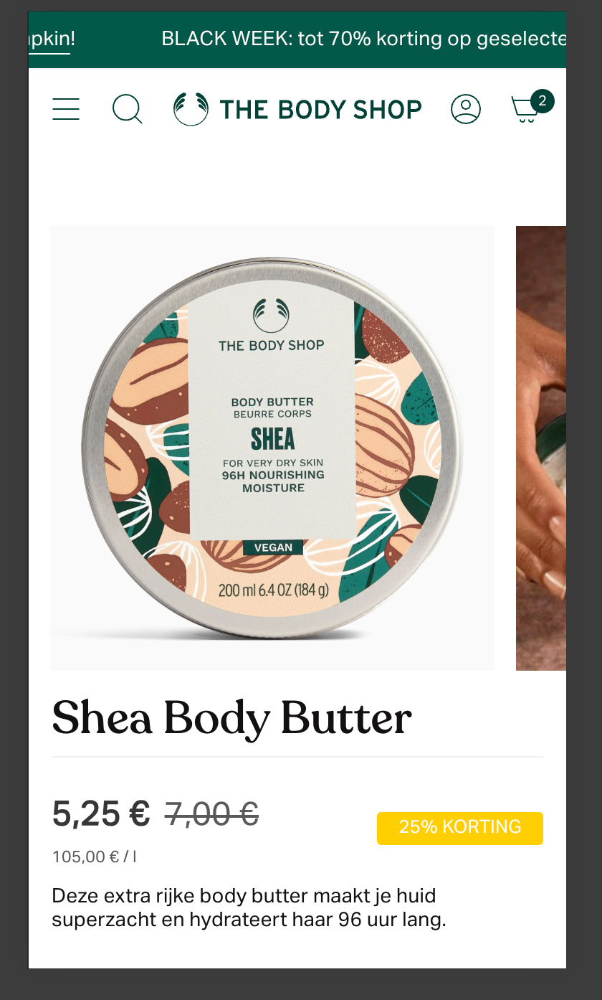
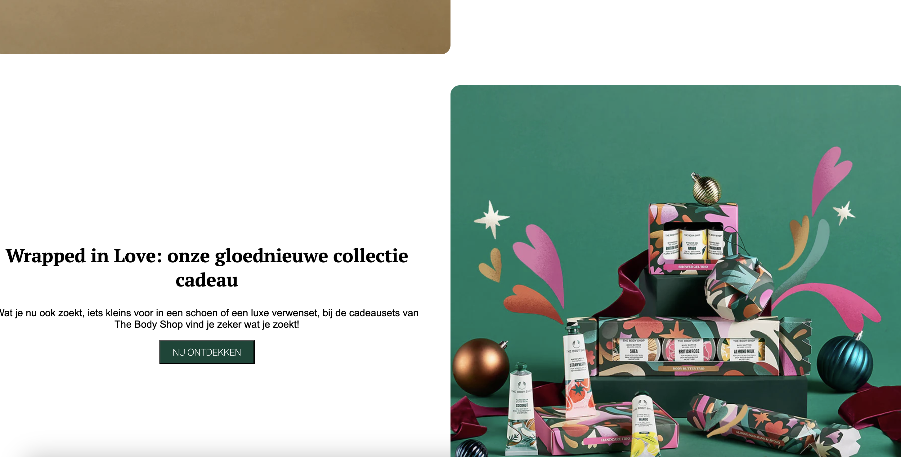
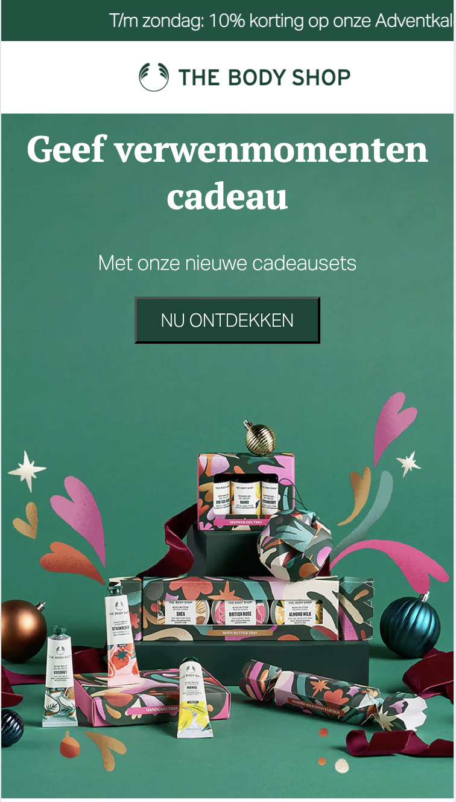
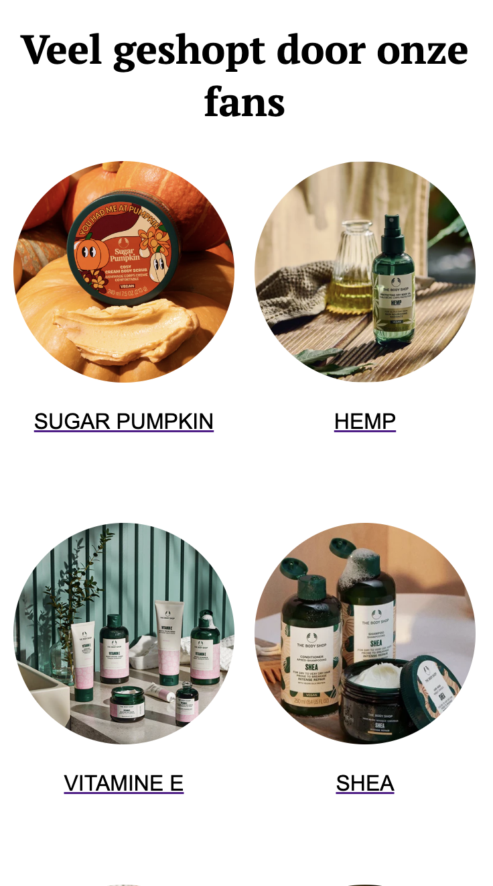
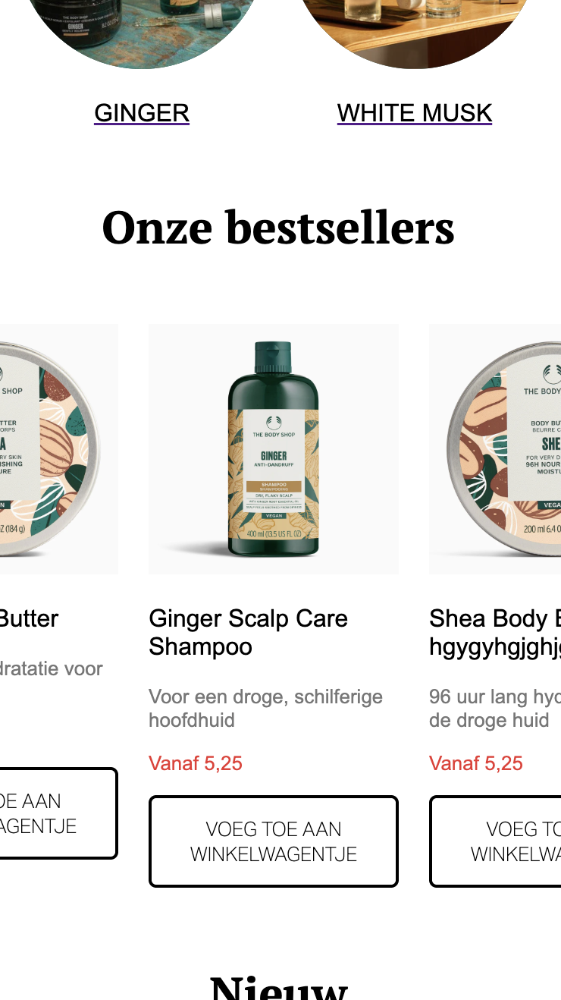
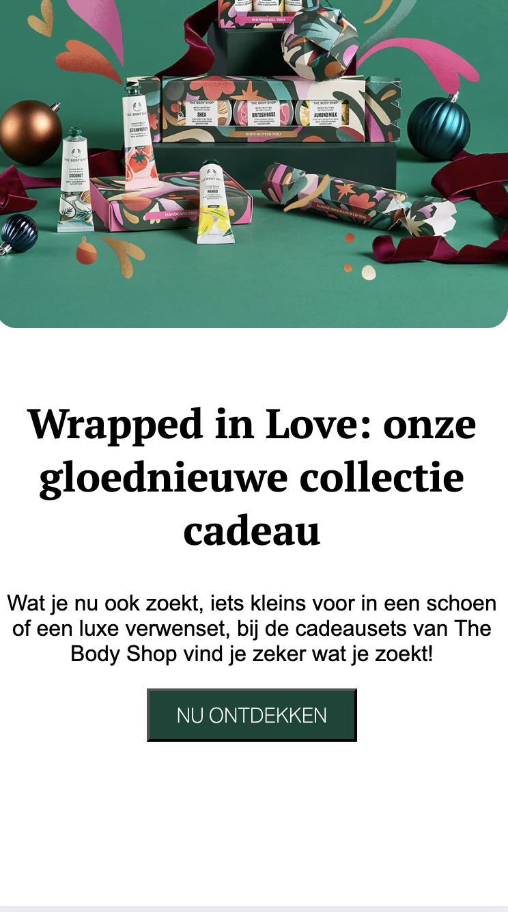
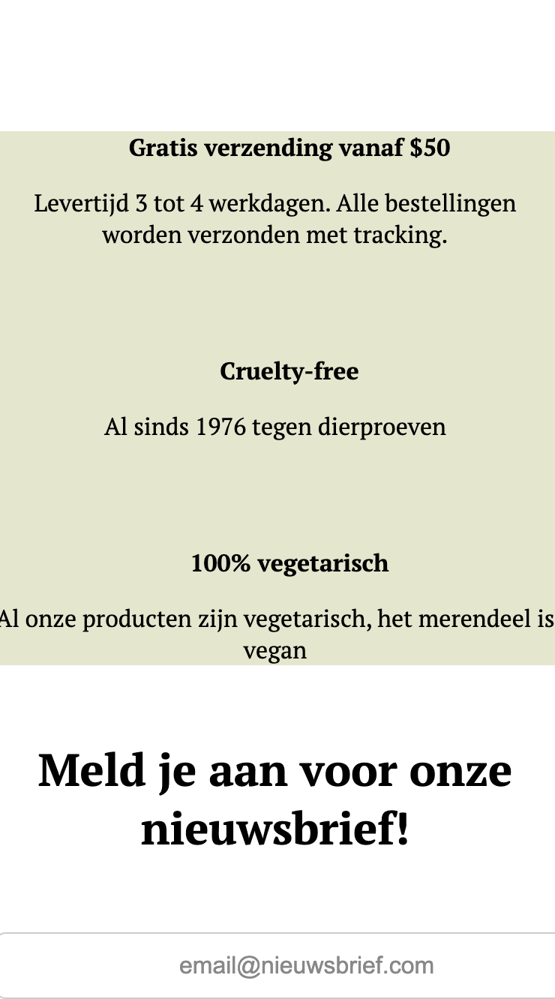
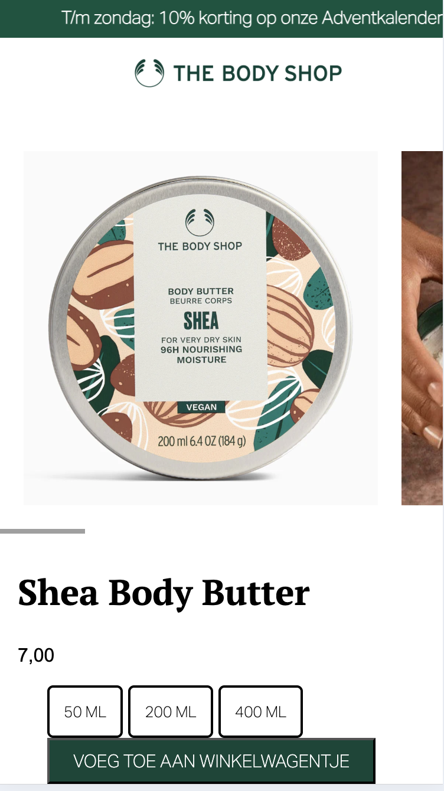
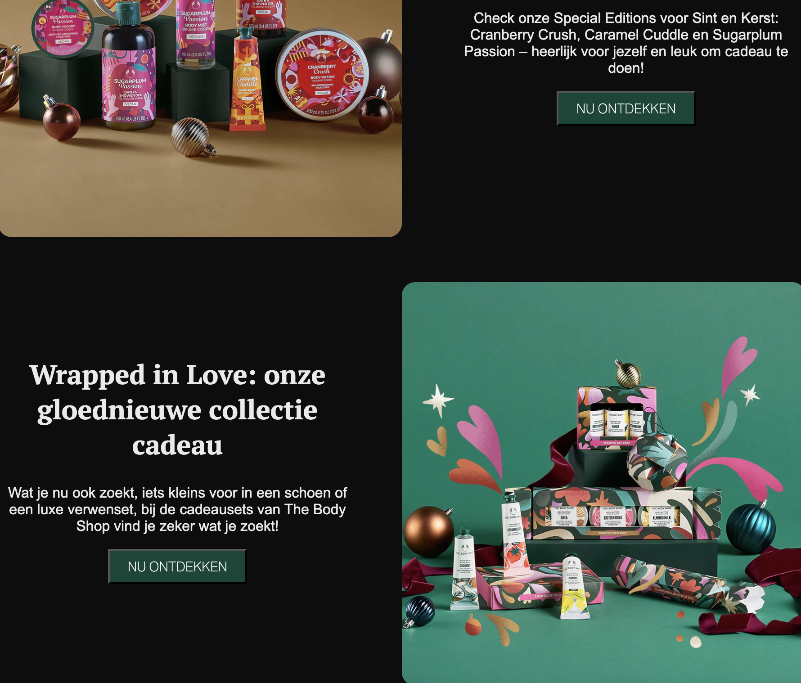

# Procesverslag
Markdown is een simpele manier om HTML te schrijven.  
Markdown cheat cheet: [Hulp bij het schrijven van Markdown](https://github.com/adam-p/markdown-here/wiki/Markdown-Cheatsheet).

Nb. De standaardstructuur en de spartaanse opmaak van de README.md zijn helemaal prima. Het gaat om de inhoud van je procesverslag. Besteedt de tijd voor pracht en praal aan je website.

Nb. Door *open* toe te voegen aan een *details* element kun je deze standaard open zetten. Fijn om dat steeds voor de relevante stuk(ken) te doen.

## Jij

  
uitwerken voor kick-off werkgroep

  ### Auteur:
  Anne van Mill 

  #### Je startniveau:
  Blauw (kies uit zwart, rood óf blauw)

  #### Je focus:
  Responsive (kies uit responsive óf surface plane)
 

## Je website

  
uitwerken voor kick-off werkgroep

  ### Je opdracht:
  link naar de website die je gaat namaken óf de naam/omschrijving van je eigen ontwerp
      <link rel="thebodyshop" href="https://thebodyshop.nl/" />
  #### Screenshot(s) van de eerste pagina (small screen): 
  

  #### Screenshot(s) van de tweede pagina (small screen):
  
 

## Toegankelijkheidstest 1/2 (week 1)

  
uitwerken na test in 2e werkgroep

  ### Bevindingen
  Lijst met je bevindingen die in de test naar voren kwamen:

Screenreader
  Ik heb de screenreader geopend via de instellingen van mijn MacBook. Eigenlijk begon de screenreader gelijk alles al voor te lezen. 

  - Om alleen de headings te laten lezen heb ik met de sneltoets Control + Option + I het menu kunnen openen en daaruit kunnen kiezen dat ik alle headings wilde voor laten lezen. Ik kon door gebruik te maken van de pijljtes op mijn toetsenbord makkelijk navigeren door het menu heen. Dit pakte de screenreader goed op.

  - Daarnaast heb ik de screenreader alle linkjes voor laten lezen door de sneltoets Control + Option + U. Dit pakte de screenreader goed op en hij las elke link voor, ook gaf de screenreader aan welke links ik al bezocht had. 

- De screenreader gaf ook tips bij buttons, bijvoorbeeld hoe ik ze kon activeren om naar een andere pagina te gaan. Dit maakt het veel makkelijker om te begrijpen hoe je met de website kunt interacteren zonder te kijken.

- Alles op de website kon ik bedienen met alleen mijn toetsenbord, zonder muis. Dit is fijn voor mensen die een muis niet kunnen gebruiken.

- De website werkt ook goed op verschillende schermgroottes. Zelfs als het scherm kleiner wordt, blijft de screenreader alles goed voorlezen en kan ik makkelijk navigeren. De afbeeldingen en tekst bewegen goed mee. 

Kleuren:
- Ik vind dat de kleuren van de huidige website goed werken, het contrast tussen de witte achtergrond en zwarte tekst is groot genoeg waardoor mensen die kleurenblind zijn hier geen last van hebben. De afbeeldingen zijn in beeld ook duidelijk genoeg waardoor de kleur van de afbeeldingen eigenlijk niet uitmaken. 

Verbeterpunten:
- Dark Modus: De huidige website heeft geen darkmodus, dit wil ik graag toevoegen om mijn eigen website zo toegankelijk mogelijk te maken. 

- De huidige website gebruikt enorm veel divs in de code, ik wil dit in mijn eigen code zo min nogelijk gebruiken. Ik vind de code van de bodyshop website namelijk erg moeilijk te lezen hierdoor. 

- Website bevat geen titels zoals 'homepagina' 'productpagina' -> dit kan ingewikkeld zijn voor mensen die de screenreadeer gebruiken omdat het niet altijd duidelijk is op welke plek zij zich bevinden op de website. Wat ik wil doen is goede titels gebruiken om dit op te lossen.

## Breakdownschets (week 1)

  
uitwerken na afloop 3e werkgroep

  ### de hele pagina: 
  

link naar figma breakdown schets geheel 

  <link rel="figma breakdown" href="https://www.figma.com/proto/99cxJ3oCvlksaJLmzPMKTp/FED-break?node-id=0-1&t=LPtRHy2lMBXBFXcU-1" />

## Voortgang 1 (week 2)

  
uitwerken voor 1e voortgang

  ### Stand van zaken
  hier dit ging goed & dit was lastig (neem ook screenshots op van delen van je website en code)

  Over het algemeen gaat het coderen best goed. Wel heb ik geprobeerd om een hamburgermenu te maken, dit ging nog niet goed dus ik ben eerst bezig met het samenstellen van mijn HTML-code en daarbij alvast wat CSS te maken. Ik vind coderen erg moeilijk maar ik ben tot nu toe blij met hoe het gaat. 
  

  ### Agenda voor meeting

  Wat wil ik vragen tijdens het voortgangsgesprek?
  - Ziet de code er semantisch correct uit?
  - Hoe website goed op GitHub zetten?

  ### Verslag van meeting
  hier na afloop snel de uitkomsten van de meeting vastleggen

  - Code goed opstellen met spaties -> Prettier gebruiken
  - Breakdown schets gedetailleerder maken -> alle elementen erin zetten
  - Minder classes gebruiken -> elementen aanroepen in css niet door aparte classes, geef section een klas maar roep de verschillende elementen apart aan -> wordt overzichtelijker 

## Voortgang 2 (week 3)

  
uitwerken voor 2e voortgang

  ### Stand van zaken

 -  Minder classes gebruikt -> zijn het er nog te veel?
 - Met wat hulp van Ivo heb ik de carousel kunnen maken zoals ik wil dus dat gaat goed. Ik ben nogsteeds bezig met het hamburgermenu maken, dat is nog niet gelukt. Het linken van de extra pagina gaat goed.
 - Ik wil onder alle cirkels de titels van de producten zetten, ik weet nog niet hoe ik dit ga doen. 
 - Ook is mijn website niet over heel de breedte als je uitzoomt, dit wil ik aanpassen. 

  ### Agenda voor meeting

Wat wil ik vragen tijdens het voortgangsgesprek?
- HTML code doornemen en kijken of alles klopt (kloppen de classes, sections en divs, gebruik van h1 etc goed?)

  ### Verslag van meeting
  hier na afloop snel de uitkomsten van de meeting vastleggen

  - Kijken naar de H1 en H2, teveel gebruik gemaakt van H, alle H moet een H2 worden 
  - Alleen de section met de info over gratis verzending kopjes mogen H3 worden
  - Maak een transparante H1 als titelpagina maar zorg ervoor dat hij niet zichtbaar is in de website maar wel voor een screenreader 
  - De 'Cirkel' classes kunnen weg en kunnen aangeroepen worden als .items img

## Toegankelijkheidstest 2/2 (week 4)

  
uitwerken na test in 9e werkgroep

  ### Bevindingen
  Lijst met je bevindingen die in de test naar voren kwamen (geef ook aan wat er verbeterd is):

- Na het maken van de eerste toegankelijkheidstest ben ik gaan kijken hoe ik de dingen die nog miste, op mijn eigen website kon toevoegen. Wat is er verbeterd?
- Mijn website heeft nu een darkmodus, dit had de echte website niet. Ik denk dat dit een goede toevoeging is voor de toegankelijkheid. 
- Ik heb geprobeerd om de structuur van de website hetzelde te houden, zodat deze meer overeenkomt met het origineel. Wel heb ik overlappende content weggelaten om het overzichtelijk te houden.
- Om de screenreader te verbeteren zitten er hidden h1 met paginatitels in de code zodat deze worden voorgelezen maar niet zichtbaar zijn. Hierdoor kunnen mensen die gebruik maken van de screenreader beter volgen waar zij zich bevinden. 
- Content beweegt mee (responsive) 

## Voortgang 3 (week 4)

  
uitwerken voor 3e voortgang

  ### Stand van zaken
  hier dit ging goed & dit was lastig (neem ook screenshots op van delen van je website en code)

  Ik ben lekker bezig geweest met verder coderen en dingen uit te proberen. Op dit moment ben ik bezig met het responsive maken van mijn website, ik heb de afbeeldingen met een mediaquery erin gezet zodat deze verschuiven bij verschillende formaten. Ook de carousel met producten schuiven mee. Daarnaast heb ik in mijn HTML-code de lijst met producten en de cirkels veranderd naar Li ipv losse divs en p'tjes. Ook heeft Ivo mij gehoplen om de namen onder de cirkels te krijgen en dat deze naar de productpagina leiden als je erop klikt. Ik heb een transparante H1 toegevoegd voor de toegankelijkheid. 

   

 

  ### Agenda voor meeting

Wat wil ik vragen tijdens het voortgangsgesprek? 
- Is de content genoeg op de website?
- Is de code correct?
- De eerste lijst met <li> items heeft geen <ul> omdat als ik deze toevoeg verschuiven de items, hoe los ik dit op?
- Hoe hamburger menu maken?

  ### Verslag van meeting
  hier na afloop snel de uitkomsten van de meeting vastleggen

  - Javascript link buiten de <footer> plaatsen
  - <ul> om de eerste lijst met <li> zetten door de class om de <ul> te zetten en niet om de section
  - Om de juiste fonts te krijgen die worden gebruikt op de officiele website moet ik kijken bij Inspecteren -> Network. En dan de juiste fonts downloaden en de link in html zetten
  - Code van de hamburger opdracht op de FED Dlo pagina nog een keer proberen

## Eindgesprek (week 5)

  
uitwerken voor eindgesprek

  ### Je uitkomst - karakteristiek screenshots:

  
  
  
  
  
  

  ### Dit ging goed/Heb ik geleerd: 

Ik heb geleerd hoe je onderdelen op je pagina responsive maakt zodat deze aanpassen naar verschillende schermen. Hiervoor heb ik geleerd hoe je media-querys kunt gebruiken om dit te kunnen bereiken. Daarnaast heb ik geleerd hoe je een carousel in elkaar zet, ook waarbij er afbeeldingen, knoppen en tekst staan. Ik heb geleerd om mijn website een Dark modus te geven, ik vind het leuk hoe dit is geworden. Ik heb geleerd hoe je uit de Inspecteren tool verschillende informatie uit een website kunt halen. Hierdoor kon ik de lettertypen overnemen om mijn website beter op de echte te laten lijken. Ik ben blij hoe de afbeeldingen responsive zijn geworden en ik ben best tevreden over wat ik allemaal heb geleerd tijdens dit vak. Ik merk dat ik een stuk verder ben gekomen dan vorig jaar. 

  
  

  ### Dit was lastig/Is niet gelukt:

Waar ik echt van baal is dat het hamburger menu niet is gelukt. Ik heb filmpjes op Youtube gekeken, de opdracht gemaakt van de Dlo FED pagina, op websites gekeken maar ben er helaas echt niet uitgekomen. Als ik langer de tijd had gehad had ik dit nog graag uit willen werken. 

## Bronnenlijst

  
continu bijhouden terwijl je werkt

  Nb. Wees specifiek ('css-tricks' als bron is bijv. niet specifiek genoeg). 
  Nb. ChatGpT en andere AI horen er ook bij.
  Nb. Vermeld de bronnen ook in je code.

  1. https://chatgpt.com/ ChatGPT -> gebruikt voor het structureren van code, stukjes css 
  2. CSS tricks Dark mode -> gebruikt voor 
  3. CSS tricks Carousel
  4. FED Dlo pagina -> gebruikt voor de emailadresbalk, uitleg over flex en grid
  5. CSS tricks Grid Layout Guide -> leren over grid layout 
  6. W3schools -> uitleg over z-index

